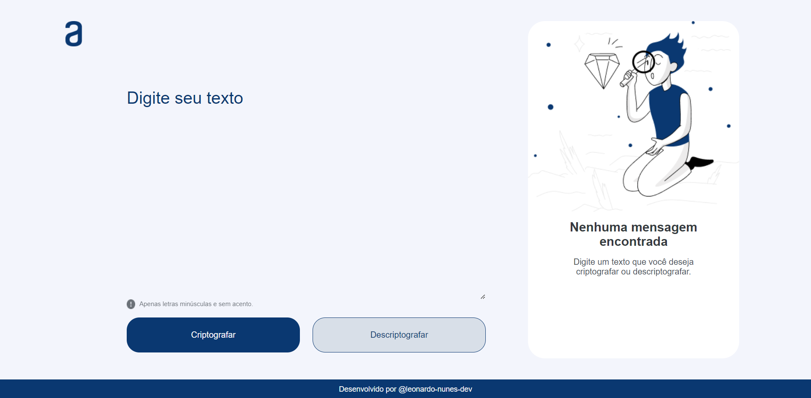

# Encrypt Text

## Sobre

Este projeto foi desenvolvido como parte do desafio da formação **Iniciante em Programação** da *Oracle Next Education*, em parceria com a *Alura*.

### Objetivo

O projeto foi concebido como parte de um desafio proposto durante a formação, oferecendo aos participantes a oportunidade de aplicar e aprimorar seus conhecimentos em programação.

### Como Funciona

O Encrypt Text é um encriptador de texto simples que utiliza um algoritmo de substituição para criptografar e descriptografar mensagens.

Para isso, o usuário digita um texto *sem acentos, caracteres especiais e com todas as letras minúsculas*. Ao pressionar o botão **criptografar**, o texto é transformado com base em um padrão de substituição. Da mesma forma, ao digitar ou colar um texto já criptografado e utilizar o botão **descriptografar**, o texto é revertido para a forma original.

Sinta-se à vontade para explorar e utilizar esta ferramenta interativa de encriptação de texto!

### Como Acessar

Este projeto está disponível online e pode ser acessado [aqui](https://futurodevleo.github.io/challenges-alura-oracle-one/)

### Tecnologias

